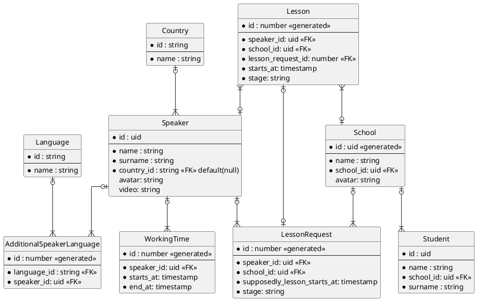
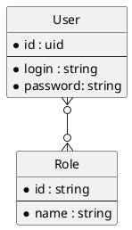
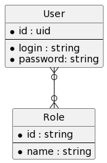
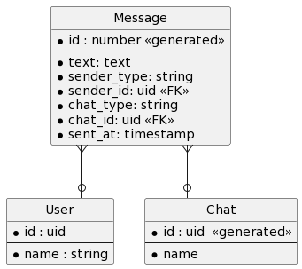
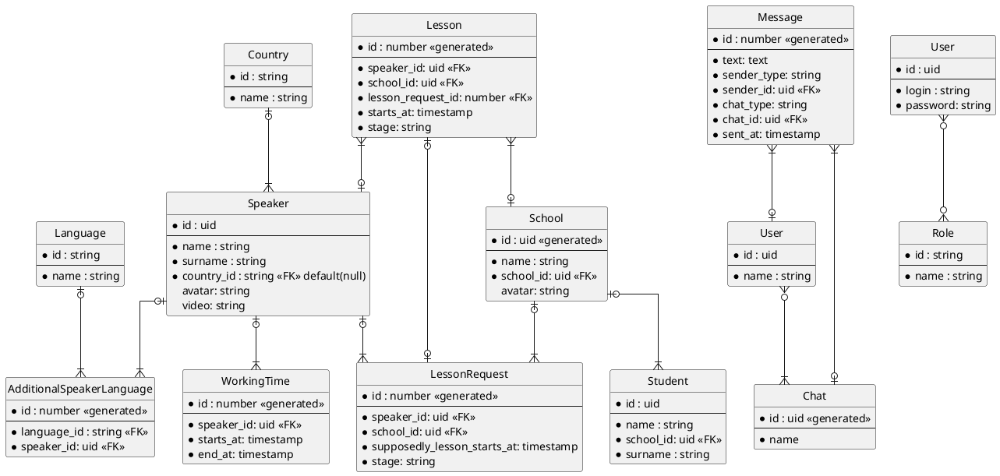
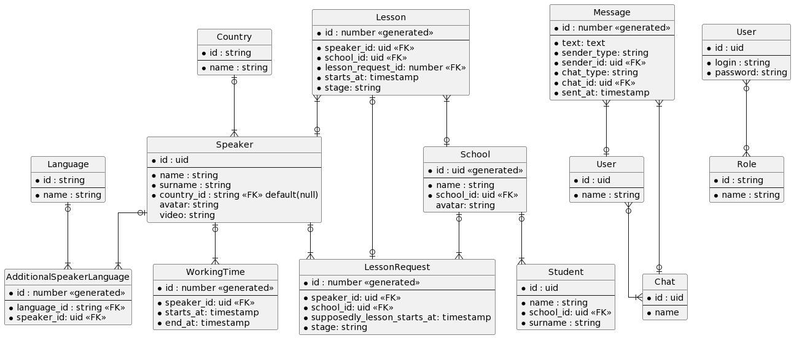

# Database structure

[<-Home](../README.md)

## Contents
[core-service](#core) 
[auth-service](#auth) 
[chat-service](#chat) 
[general](#general) 

<a id="core"/>

# Core-service

<a id="auth"/>

## Auth-service

<a id="chat"/>

## Chat-service

<a id="general"/>

## General

